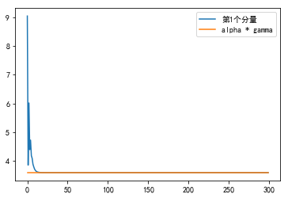
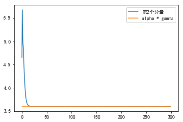
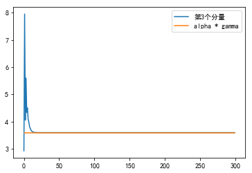

#### 2.1

(a)首先化简(1)可得
$$
\begin{aligned}
p_{i}(t+1)&=p_{i}(t)\times \frac {\alpha \gamma} {S_{i}(t)}\\
&=\alpha \gamma\times \frac { p_{i}(t) q_i(t)} {s_{i}(t)}  \\
&=\alpha \gamma  \frac {\left(\sigma+\sum_{j \neq i} G_{i j} p_{j}(t) \right) p_i(t)} 
{G_{ii} p_i(t)} \\
&=\alpha \gamma \sum_{j \neq i} \frac {G_{i j}}{G_{ii}} p_{j}(t) 
+ \frac{\alpha \gamma \sigma }{G_{ii}}\\
&=\alpha \gamma\left (\sum_{j =1}^n \frac {G_{i j}}{G_{ii}} p_{j}(t) \right)
-\alpha \gamma p_i(t) +\frac{\alpha \gamma \sigma }{G_{ii}}
\end{aligned}
$$
记
$$
\begin{aligned}
\Lambda &=\text{diag}(G_{11},\ldots, G_{nn})\\
1_n&=  \left[
 \begin{matrix}
1 \\
\vdots\\
1
  \end{matrix}
  \right] 
\end{aligned}
$$
所以
$$
\begin{aligned}
p(t+1)
&=  \alpha \gamma\left(\Lambda^{-1} G -I_n \right)p(t) + \alpha \gamma \sigma 
\Lambda^{-1}1_n\\
&\triangleq Ap(t)+ b
\end{aligned}
$$
其中
$$
\begin{aligned}
A&=  \alpha \gamma\left(\Lambda^{-1} G -I_n \right)  \\
b&= \alpha \gamma \sigma 
\Lambda^{-1}
\end{aligned}
$$
(b)首先给出$s_i(t),q_i(t)$的矩阵形式
$$
\begin{aligned}
s(t)&=\Lambda^{-1} p(t)\\
q(t)&= \sigma I_n + (G- \Lambda)p(t)
\end{aligned}
$$

对应代码如下：

```python
import numpy as np
import matplotlib.pyplot as plt
plt.rcParams['font.sans-serif']=['SimHei'] #用来正常显示中文标签
plt.rcParams['axes.unicode_minus']=False #用来正常显示负号

G = np.array([[1, 0.2, 0.1], [0.1, 2, 0.1], [0.3, 0.1, 3]])
gamma = 3
alpha = 1.2
sigma = 0.01
p = np.random.rand(3).reshape(-1, 1)
N = 300

def f(G, gamma, alpha, sigma, p, N):
    #数据维度
    n = G.shape[0]
    
    Lambda = np.diag(G).reshape(-1, 1)
    Res = np.array([])
    for i in range(N):
        s = Lambda * p
        q = sigma + G.dot(p) - Lambda * p
        S = s / q
        if i == 0:
            Res = np.copy(S)
        else:
            Res = np.c_[Res, S]
        #更新
        p = alpha * gamma * ((G / Lambda).dot(p) - p) + \
            alpha * gamma * sigma / Lambda
    
    target = np.ones(N) * alpha * gamma
    for i in range(n):
        si = Res[i, :]
        label = "第" + str(i+1) + "个分量"
        plt.plot(si, label=label)
        plt.plot(target, label="alpha * gamma")
        plt.legend()
        plt.show()

f(G, gamma, alpha, sigma, p, N)
```







利用该算法，最后每个分量都会收敛到$\alpha \gamma$。


#### 2.2

因为
$$
\begin{equation}
M \ddot{q}+D \dot{q}+K q=f
\end{equation}
$$
并且$M$可逆，所以
$$
\ddot q =M^{-1}f - M^{-1} Kq -M^{-1} D\dot q
$$
回顾动力系统的形式：
$$
\begin{equation}
\dot{x}=A x+B u, \quad y=C x+D u
\end{equation}
$$
结合题目可得
$$
\begin{aligned}
\dot x
&=  \left[
 \begin{matrix}
 \dot q \\
 \ddot 	q
  \end{matrix}
  \right] \\
  &= \left[
 \begin{matrix}
 \dot q \\
M^{-1}f - M^{-1} Kq -M^{-1} D\dot q
  \end{matrix}
  \right]\\
  &=  \left[
 \begin{matrix}
 0&I_k \\
- M^{-1} K &  -M^{-1} D
  \end{matrix}
  \right] \left[
 \begin{matrix}
  q \\
 \dot 	q
  \end{matrix}
  \right]  + \left[
 \begin{matrix}
  0 \\
 M^{-1}
  \end{matrix}
  \right]  f\\
  &=\left[
 \begin{matrix}
 0&I_k \\
- M^{-1} K &  -M^{-1} D
  \end{matrix}
  \right]   x + \left[
 \begin{matrix}
  0 \\
 M^{-1}
  \end{matrix}
  \right]  u\\
  y&= q\\
  &= \left[
 \begin{matrix}
 I_k&  0\\
  \end{matrix}
  \right]  \left[
 \begin{matrix}
  q \\
 \dot 	q
  \end{matrix}
  \right]  \\
  &= \left[
 \begin{matrix}
 I_k&  0\\
  \end{matrix}
  \right]  x
\end{aligned}
$$


#### 2.3

回顾离散时间的线性动力系统形式：
$$
x(t+1)=A(t) x(t)+B(t) u(t), \quad y(t)=C(t) x(t)+D(t) u(t)
$$
MA模型：

记
$$
\begin{aligned}
x(k)&=\left[ \begin{array}{c}{u(k-1)} \\ {\vdots} \\ {u(k-r)}\end{array}\right]\\
u(k)&=u(k)\\
C&= [a_1, \ldots,a_r]\in \mathbb R^{1\times r}\\
D&=  a_0
\end{aligned}
$$
那么
$$
y(k)= C x(k)+Du(k)
$$
AR模型：

记
$$
\begin{aligned}
x(k)&=\left[ \begin{array}{c}{y(k-1)} \\ {\vdots} \\ {y(k-p)}\end{array}\right]\\
u(k)&= \left[ 
\begin{array}{c}
u(k)  \\ 
0\\
{\vdots} \\ 
0\end{array}\right] \in \mathbb R^p\\
b&= [b_1, \ldots,b_p]\in \mathbb R^{1\times p}\\
A & =\left[
	\begin{matrix}
	b \\ 

	I_{p-1}& 0
	\end{matrix}
	\right]\\
B&=1
\end{aligned}
$$
那么
$$
\begin{aligned}
x(k+1)
&=\left[ \begin{array}{c}{y(k)} \\ y(k-1)\\ {\vdots} \\ {y(k-p+1)}\end{array}\right]\\
&=\left[ 
\begin{array}{c}
{u(k)+b_{1} y(k-1)+\cdots+b_{p} y(k-p)} \\ 
y(k-1)\\
{\vdots} \\ 
{y(k-p+1)}\end{array}\right] \\
&= \left[ 
\begin{array}{c}
{b_{1} y(k-1)+\cdots+b_{p} y(k-p)} \\ 
y(k-1)\\
{\vdots} \\ 
{y(k-p+1)}\end{array}\right] + 
 \left[ 
\begin{array}{c}
u(k)  \\ 
0\\
{\vdots} \\ 
0\end{array}\right]\\
&=\left[
	\begin{matrix}
	b \\ 

	I_{p-1}& 0
	\end{matrix}
	\right] x(k) + u(k)\\
&= Ax(k) + Bu(k)
\end{aligned}
$$
ARMA模型：

记
$$
\begin{aligned}
x(k)&=
\left[
	\begin{matrix}{}
	{y(k-1)} \\ {\vdots} \\ {y(k-p)}\\
	{u(k-1)} \\ {\vdots} \\ {u(k-r)}
	\end{matrix}
	\right]\in \mathbb R^{p+r}\\
u(k)&=u(k)	\\
a&=  [a_1, \ldots,a_r]\in \mathbb R^{1\times r}\\
b&= [b_1, \ldots,b_p]\in \mathbb R^{1\times p}\\
A_1 &= [a,b]\in \mathbb R^{1\times p}\\
A_2 &= [I_{p-1},0]\in \mathbb R^{(p-1)\times p}\\
A_3 &= 0\in \mathbb R^{1\times p}\\
A_4&= [0, I_{r-1}, 0]\in \mathbb R^{(r-1)\times p}
\end{aligned}
$$
那么
$$
\begin{aligned}
x(k+1)
&=\left[
	\begin{matrix}{}
	{y(k)}\\{y(k-1)} \\ {\vdots} \\ {y(k-p+1)}\\
	u(k)\\
	{u(k-1)} \\ {\vdots} \\ {u(k-r+1)}
	\end{matrix}
	\right]\\
	&=\left[
	\begin{matrix}{}
	b_{1} y(k-1)+\cdots+b_{p} y(k-p)+a_{0} u(k)+\cdots+a_{r} u(k-r)\\
	{y(k-1)} \\ {\vdots} \\ {y(k-p+1)}\\
	u(k)\\
	{u(k-1)} \\ {\vdots} \\ {u(k-r+1)}
	\end{matrix}
	\right] \\
	&= \left[
	\begin{matrix}
	A_1\\
	A_2\\
	A_3\\
	A_4
	\end{matrix}
	\right] x(k)  +   \left[
 \begin{matrix}
a_0 \\
0\\
  \vdots \\
  0\\
  1\\
   0\\
 \vdots \\
  0
  \end{matrix}
  \right]  u(k)
\end{aligned}
$$
记
$$
\begin{aligned}
A &=  \left[
	\begin{matrix}
	A_1\\
	A_2\\
	A_3\\
	A_4
	\end{matrix}
	\right] \in \mathbb R^{(p+r)\times (p+r)} \\
B&=	\left[
 \begin{matrix}
a_0 \\
0\\
  \vdots \\
  0\\
  1\\
   0\\
 \vdots \\
  0
  \end{matrix}
  \right] \in \mathbb R^{p+r} 
\end{aligned}
$$
其中
$$
B_i=\begin{cases}
a_0 & i=1\\
1 & i=p+1\\
0&其他
\end{cases}
$$
那么模型为
$$
x(k+1)=Ax(k)+Bu(k)
$$


#### 2.4

定义$n$维标准单位列向量$u_i\in \mathbb R^n$：
$$
u_{1}=\left[ \begin{array}{c}{1} \\ {0} \\ {0} \\ {\vdots} \\ {0}\end{array}\right], u_{2}=\left[ \begin{array}{c}{0} \\ {1} \\ {0} \\{\vdots}  \\ {0}\end{array}\right], \dots, u_{n}=\left[ \begin{array}{c}{0} \\ {0} \\ {0} \\ {\vdots} \\ {1}\end{array}\right]
$$
那么
$$
x= \left[
 \begin{matrix}
  x_1 \\
\vdots\\
x_n
  \end{matrix}
  \right]  =\sum_{i=1}^n x_i u_i
$$
定义$m$维标准单位列向量$v_i\in \mathbb R^m$：
$$
v_{1}=\left[ \begin{array}{c}{1} \\ {0} \\ {0} \\ {\vdots} \\ {0}\end{array}\right], v_{2}=\left[ \begin{array}{c}{0} \\ {1} \\ {0} \\ {\vdots} \\ {0}\end{array}\right], \dots, v_{m}=\left[ \begin{array}{c}{0} \\ {0} \\ {0} \\ {\vdots} \\ {1}\end{array}\right]
$$
假设
$$
f(u_i) =\sum_{j=1}^m a_{ji} v_j ,A =[a_{ji}]\in \mathbb R^{m\times n}
$$
那么
$$
\begin{aligned}
f(x)& = f\left(\sum_{i=1}^n x_i  u_i \right)\\
&=\sum_{i=1}^n x_i f(u_i)\\
&=\sum_{i=1}^n x_i \sum_{j=1}^m a_{ji} v_j \\
&=\sum_{j=1}^m \sum_{i=1}^n  a_{ji} x_i v_j \\
&=\left[
 \begin{matrix}
\sum_{i=1}^n  a_{1i} x_i \\
  \ldots\\
\sum_{i=1}^n  a_{mi} x_i
  \end{matrix}
  \right] \\
  &= A x
\end{aligned}
$$
如果还存在$\tilde A \in \mathbb R^{m\times n}​$，使得
$$
f(x)=\tilde A x
$$
那么取$x=u_i,i=1,\dots, n$可得
$$
\begin{aligned}
f(u_i)
&= Au_i \\

&= \left[
 \begin{matrix}
 a_{1i} \\
  \ldots\\
 a_{mi} 
  \end{matrix}
  \right]\\
  &=\tilde A u_i \\
  &=\left[
 \begin{matrix}
\tilde  a_{1i} \\
  \ldots\\
 \tilde a_{mi} 
  \end{matrix}
  \right]
\end{aligned}
$$
因此
$$
A=\tilde A
$$


#### 2.6

由
$$
\mathcal D p
=\sum_{i=1}^{n-1} i a_{i} x^{i-1}
$$
可得
$$
\begin{aligned}
 \left[
 \begin{matrix}
  a_1 \\
  2a_2\\
  \vdots\\
  (n-1)a_{n-1}
  \end{matrix}
  \right] 
  &=  
 \left[
 \begin{matrix}
0&1 & &    \\
0& & 2  \\
 0 & & & \ddots & \\
  0 &&&& n-1
  \end{matrix}
  \right]
  
  \left[
 \begin{matrix}
a_0 \\
  a_1\\
  \vdots\\
a_{n-1}
  \end{matrix}
  \right] 
\end{aligned}
$$
因此
$$
D= \left[
 \begin{matrix}
0&1 & &    \\
0& & 2  \\
 0 & & & \ddots & \\
  0 &&&& n-1
  \end{matrix}
  \right]
$$


#### 2.9

(a)不难看出
$$
\left[
 \begin{matrix}
 y_1\\
 y_2
  \end{matrix}
  \right] =
    \left[
 \begin{matrix}
 2 & 0\\
 0.5 & 1
  \end{matrix}
  \right]
  \left[
 \begin{matrix}
 x_1\\
 x_2
  \end{matrix}
  \right]
$$
所以
$$
A=  \left[
 \begin{matrix}
 2 & 0\\
 0.5 & 1
  \end{matrix}
  \right]
$$
(b)利用(a)不难得出
$$
\begin{aligned}
B&= A^4 \\
&= \left( \left[
 \begin{matrix}
 2 & 0\\
 0.5 & 1
  \end{matrix}
  \right] \left[
 \begin{matrix}
 2 & 0\\
 0.5 & 1
  \end{matrix}
  \right]\right) ^2 \\
  &=\left( \left[
 \begin{matrix}
 4& 0\\
 1.5 & 1
  \end{matrix}
  \right] \right) ^2\\
  &=\left[
 \begin{matrix}
4 & 0\\
 1.5 & 1
  \end{matrix}
  \right]  \left[
 \begin{matrix}
4 & 0\\
 1.5 & 1
  \end{matrix}
  \right]  \\
  &=\left[
 \begin{matrix}
 16 & 0\\
7.5 & 1
  \end{matrix}
  \right] 
\end{aligned}
$$
另一方面，直接考虑该问题，我们知道$x_1$到$z_1$的路线只有一条，所以$b_{11}=2^4=16$；$x_2$到$z_2$的路线只有一条，所以$b_{22}=1^4=1$；$x_2$到$z_1$没有路线，所以$b_{12}=0$；$x_1$到$y_2$的路线一共有$4$条，总权重为
$$
0.5+2\times 0.5 + 2^2\times 0.5 +2^3\times 0.5=7.5
$$


#### 2.12

首先考虑$(A^2)_{ij}$：
$$
(A^2)_{ij}=\sum_{k=1}^n A_{ik}A_{kj}
=i到j长度为2的路径数量
$$
递推可得
$$
B_{ij}=(A^k)_{ij}=i到j长度为k的路径数量
$$


#### 补充题

(a)$\forall \alpha,\beta ,\alpha+\beta =1$：
$$
\begin{aligned}
f(\alpha x +\beta y)
&= A(\alpha x+\beta y) +b\\
&=A(\alpha x+\beta y) +b(\alpha+\beta)\\
&=\alpha(Ax+b) +\beta (Ax+b)\\
&=\alpha f(x)+\beta f(y)
\end{aligned}
$$
(b)考虑
$$
g(x)=f(x)-f(0)
$$
下面证明该函数为线性函数，首先证明
$$
g(kx) =kg(x)
$$
由定义，这等价于
$$
\begin{aligned}
f(kx) -f(0)&= k(f(x)-f(0)) \Leftrightarrow \\
f(kx)+(k-1)f(0) & =kf(x) \Leftrightarrow\\
\frac 1 k f(kx) +\frac {k-1}k f(0)
&=f(x)
\end{aligned}
$$
最后一行由$f(x)​$的性质即可得到。

接着证明
$$
g(x+y)=g(x)+g(y)
$$
事实上，我们有
$$
\begin{aligned}
g(x+y)
&= f( x+ y)-f(0) \\
&=f\left( \frac{1}{2} \times 2x +
\frac{1}{2} \times 2 y\right)-
\frac{1}{2}f(0) -
\frac{1}{2} f(0) \\
  &=\frac{1}{2} f\left(2x \right)+
\frac{1}{2} f\left(2y \right)-
\frac{1}{2}f(0) -
\frac{1}{2} f(0) & 由f(x)的性质\\
  &=\frac{1}{2}\left( f\left(2x \right)- f(0)  \right)+
  \frac{1}{2}\left( f\left(2y \right)- f(0)  \right)\\
  &=\frac{1}{2} g(2x) +\frac{1}{2} g(2y)\\
  &=\frac 1 2 \times 2 \times  g(x)+
  \frac 1 2 \times 2 \times  g(y) &由g(kx)=kg(x)\\
  &=g(x)+g(y)
\end{aligned}
$$
结合以上两点，$g(x)$是线性函数，所以存在唯一的$A$，使得
$$
g(x)=f(x)-f(0)= Ax
$$
现在记
$$
b= f(0)
$$
那么
$$
g(x) =Ax+b
$$
$A$的唯一性已经说明，现在说明$b$的唯一性即可。若存在$\tilde b$同样满足条件，那么
$$
\tilde b =g(0) =b
$$
因此$b​$唯一。