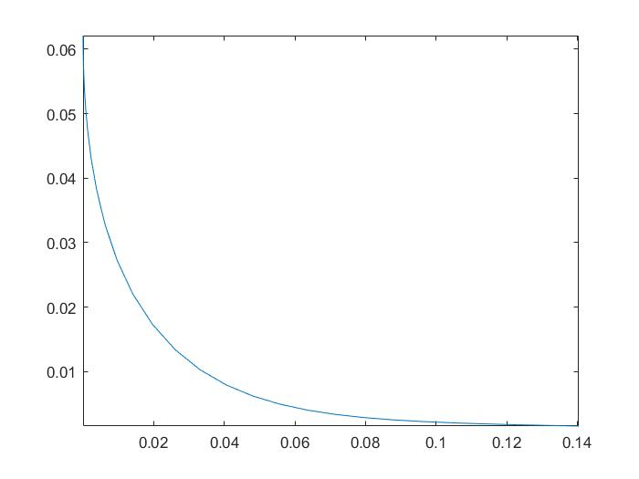

#### 5.2

(a)

因为
$$
\begin{aligned}
\langle u,v \rangle
&=u^* v\\
&=(\Re u -i\Im u )^T(\Re v +i\Im v )\\
&=(\Re u)^T\Re v  +(\Im u)^T\Im v 
+((\Re u)^T\Im v  -(\Re v)^T\Im u)i\\


\langle\tilde{u}, \tilde{v}\rangle
&=\left[ \begin{array}{l}{\Re u} \\ {\Im u}\end{array}\right]^T 
\left[ \begin{array}{l}{\Re v} \\ {\Im v}\end{array}\right]\\
&=(\Re u)^T\Re v+(\Im u)^T\Im v
\end{aligned}
$$
所以
$$
\langle\tilde{u}, \tilde{v}\rangle =\Re \langle u,v \rangle \tag 1
$$
(b)
$$
\begin{eqnarray*}

\| u\|
&&=\left(\left|u_{1}\right|^{2}+\cdots+\left|u_{n}\right|^{2}\right)^{1 / 2} \\
&&=\left(\left|\Re u_{1}\right|^{2}+\left|\Im u_{1}\right|^{2}+\cdots+\left|\Re u_{n}\right|^{2}+\left|\Im u_{n}\right|^{2}\right)^{1 / 2}\\
&&= \left(\left|\Re u\right|^{2}  +\left|\Im u\right|^{2}\right)^{1 / 2}\\
&&=\|\tilde u \| \tag{2}
\end{eqnarray*}
$$
另解：对(1)中取
$$
u=v
$$
那么由于
$$
(\Re u)^T\Im v  -(\Re v)^T\Im u=(\Re u)^T\Im u  -(\Re u)^T\Im u=0
$$
即虚部为$0​$，所以
$$
\|\tilde u \|^2=\langle\tilde{u}, \tilde{u}\rangle = \langle u,u\rangle 
=\|u \|^2
$$


(c)
$$
\begin{eqnarray*}
Au
&&=\left(\Re A + i\Im A \right)
\left(\Re u + i\Im u \right)\\
&&=\Re A \Re u  -\Im A \Im u  +\left(\Re A \Im u +  \Im A \Re u \right)i\\

\tilde A \tilde u
&&=
\left[ \begin{array}{cc}{\Re A} & {-\Im A} \\ {\Im A} & {\Re A}\end{array}\right] 
\left[ \begin{array}{l}{\Re u} \\ {\Im u}\end{array}\right]\\
&&=\left[ \begin{matrix}
\Re A \Re u -\Im A \Im u \\
\Re A \Im u +  \Im A \Re u
\end{matrix}\right] \\
&&=\widetilde{(Au)}  \tag 3
\end{eqnarray*}
$$
(d)
$$
\begin{eqnarray*}

\tilde{A}^T
&&=\left[ \begin{matrix}
{\Re A^T} & {\Im A^T} \\ 
{-\Im A^T} & {\Re A^T}
\end{matrix}\right] \\

A^*
&&= \Re A^T -i \Im A^T\\
\tilde A^* 
&&= \left[ \begin{matrix}
{\Re A^T} & {\Im A^T} \\ 
{-\Im A^T} & {\Re A^T}
\end{matrix}\right]\\
&&=\tilde A^T \tag 4
\end{eqnarray*}
$$
(e)补充证明如下结论：
$$
\widetilde {(A^{-1})} =(\tilde A)^{-1} \tag 5
$$
首先，我们有
$$
\begin{aligned}
I_n
&=A^{-1}A\\
&=\left(\Re (A^{-1}) + i \Im  (A^{-1}) \right)
\left(\Re A+ i \Im  A \right)\\
&=\left(\Re (A^{-1})\Re A- \Im  (A^{-1})\Im  A \right) +
i\left(\Im  (A^{-1})\Re A +\Re (A^{-1}) \Im A \right)
\end{aligned}
$$
所以
$$
\begin{aligned}
\Re (A^{-1})\Re A- \Im  (A^{-1})\Im  A & =I_n\\
\Im  (A^{-1})\Re A +\Re (A^{-1}) \Re A  & =0
\end{aligned}
$$
其次我们有
$$
\widetilde {(A^{-1})} = 
\left[ \begin{matrix}
{\Re (A^{-1})} & {-\Im  (A^{-1})} \\ 
{\Im  (A^{-1})} & {\Re  (A^{-1})}
\end{matrix}\right]
$$
所以
$$
\begin{aligned}
\widetilde {(A^{-1})} \tilde A
&=\left[ \begin{matrix}
{\Re (A^{-1})} & {-\Im  (A^{-1})} \\ 
{\Im  (A^{-1})} & {\Re  (A^{-1})}
\end{matrix}\right]

\left[ \begin{matrix}
{\Re A} & {-\Im  A} \\ 
{\Im  A} & {\Re  A}
\end{matrix}\right]\\

&=\left[ \begin{matrix}
{\Re (A^{-1})} \Re A-\Im  (A^{-1})\Im  A& -\Re (A^{-1})\Im  A-\Im  (A^{-1})\Re  A \\ 
\Re (A^{-1})\Im  A+\Im  (A^{-1})\Re  A  & {\Re (A^{-1})} \Re A-\Im  (A^{-1})\Im  A
\end{matrix}\right]\\
&=\left[ \begin{matrix}
I_n& 0\\ 
0 & I_n
\end{matrix}\right]\\
&=I_{2n}
\end{aligned}
$$
因此结论成立。


由之前的记号可得
$$
\begin{aligned}
\|A x-y\|^2
& = \|\widetilde{A x-y}\|^2 & 由(2)\\
&=\langle \widetilde{A x-y}, \widetilde{A x-y}\rangle  \\
&= \langle \tilde A\tilde  x-\tilde y,\tilde A \tilde x-\tilde y\rangle   & 由(3)\\
&=\|\tilde A\tilde  x-\tilde y\|^2
\end{aligned}
$$
由最小二乘法，我们知道该问题的解为
$$
\tilde x = (\tilde A^T \tilde A)^{-1}\tilde A^T \tilde y
$$
下面证明
$$
\tilde x_{\text{ls}} = \tilde x
$$
即
$$
\begin{aligned}
\widetilde {\left(A^{*} A\right)^{-1} A^{*}y} = (\tilde A^T \tilde A)^{-1}\tilde A^T \tilde y
\end{aligned}
$$
证明如下：
$$
\begin{aligned}
\widetilde {\left(A^{*} A\right)^{-1} A^{*}y}
&= \widetilde {\left(A^{*} A\right)^{-1}} \tilde A^* \tilde y &由(3)\\
&= \widetilde {\left(A^{*} A\right)}^{-1} \tilde A^* \tilde y &由(5)\\
&= {\left(\tilde A^{*} \tilde A\right)}^{-1} \tilde A^* \tilde y &由(3)\\
&=  (\tilde A^T \tilde A)^{-1}\tilde A^T \tilde y &由(4)
\end{aligned}
$$


#### 6.2

(a)首先目标函数为
$$
\begin{aligned}
\int_{t=0}^{10} f(t)^{2} d t
&=\sum_{i=1}^{10} \int_{i-1}^{i} f(t)^{2} d t\\
&=\sum_{i=1}^{10} \int_{i-1}^{i}x_i^{2} d t\\
&=\sum_{i=1}^{10}  x_i^{2} \\
&= \| x\|^2
\end{aligned}
$$
$\forall k, j-1< k \le j $，那么由牛顿第二定律可得，
$$
\begin{aligned}
\dot p(k)&= \int_{0}^{k} f(t) d t\\
&=\sum_{i=1}^{j-1} \int_{i-1}^{i} f(t) d t +\int_{j-1}^{k} f(t) d t\\
&=\sum_{i=1}^{j-1} \int_{i-1}^{i}x_i d t+\int_{j-1}^{k} x_j d t\\
&=\sum_{i=1}^{j-1} x_i +(k-j+1)x_j
\end{aligned}
$$
任取整数$k​$，我们有
$$
\begin{aligned}
p(k)&= \int_{0}^{k}  \dot p(t) d t\\
&= \sum_{i=1}^{k} \int_{i-1}^{i} \dot p(t)  d t\\
&= \sum_{i=1}^{k} \int_{i-1}^{i} 
\left(\sum_{k=1}^{i-1} x_k +(t-i+1)x_i \right) d t
\\
&= \sum_{i=1}^{k}
\left(\sum_{k=1}^{i-1} x_k  + \frac 12 x_i \right) d t\\
&=  \sum_{i=1}^{k}\left(k-i +\frac 12 \right)x_i
\end{aligned}
$$
所以题目中的约束条件为
$$
\begin{aligned}
\sum_{i=1}^{10}\left(10-i +\frac 12 \right)x_i&=1\\
\sum_{i=1}^{9} x_i +(10-10+1)x_j
= \sum_{i=1}^{10} x_i  &=0\\

\sum_{i=1}^{5}\left(5-i +\frac 12 \right)x_i &=0
\end{aligned}
$$
写成矩阵的形式为
$$
A x
=b
$$
其中
$$
\begin{aligned}
A&=\left[ \begin{matrix}{9.5} & {8.5} & {7.5} & {6.5} & {5.5} & {4.5} & {3.5} & {2.5} & {1.5} & {0.5} \\ {1} & {1} & {1} & {1} & {1} & {1} & {1} & {1} & {1} & {1} \\ {4.5} & {3.5} & {2.5} & {1.5} & {0.5} & {0} & {0} & {0} & {0} & {0}\end{matrix}\right]\\
b&=\left[ \begin{matrix} {1} \\ {0} \\ {0}\end{matrix}\right]
\end{aligned}
$$
所以优化问题为
$$
\begin{aligned}
\min \quad & \| x\|^2=x^T x\\
\text{subject to} \quad & Ax=b
\end{aligned}
$$
构造拉格朗日乘子：
$$
L(x,\lambda)= x^T x -\lambda^T(Ax-b)
$$
求梯度并令梯度为$0$得到：
$$
\begin{aligned}
\nabla_x L(x,\lambda) &= 2x -2A^T\lambda =0\\
\nabla_\lambda L(x,\lambda)&= Ax-b=0
\end{aligned}
$$
解得
$$
\begin{aligned}
\lambda&= \left(A A^{T}\right)^{-1} y \\
x&=A^{T}\left(A A^{T}\right)^{-1} y
\end{aligned}
$$
matlab中使用如下命令计算即可：

```
x = pinv(A) * b
```

完整代码如下：

```matlab
% (a)
a1 = linspace(9.5, 0.5, 10);
a2 = ones(1,10);
a3 = [linspace(4.5, 0.5, 5), 0 0 0 0 0];

A = [a1; a2; a3];
b = [1; 0; 0];
x = pinv(A) * b
```

```
x =
   -0.0455
   -0.0076
    0.0303
    0.0682
    0.1061
    0.0939
    0.0318
   -0.0303
   -0.0924
   -0.1545
```

作图代码：

```matlab
% 作图
% f(t)
figure(1);
subplot(3,1,1);
stairs(0:10, [x; 0]);
grid on;
xlabel('t');
ylabel('f(t)');
axis([0, 10, min(x) - 0.1, max(x) + 0.1]);

% p_dot(t)
T1 = toeplitz(ones(10,1), [1,zeros(1,9)]);
p_dot = T1 * x;
subplot(3,1,2);
plot(linspace(0, 10, 10), p_dot);
grid on;
xlabel('t');
ylabel('p_{dot}(t)');
axis([0, 10, min(p_dot) - 0.1, max(p_dot) + 0.1]);

% p(t)
T2 = toeplitz(linspace(0.5, 9.5, 10)', [0.5, zeros(1,9)]);
p = T2 * x;
subplot(3,1,3);
plot(linspace(0, 10, 10), p);
grid on;
xlabel('t');
ylabel('p(t)');
axis([0, 10, min(p) - 0.1, max(p) + 0.1]);
```

结果如下：


(b)首先
$$
\begin{aligned}
J_2&=\int_{t=0}^{10} f(t)^{2} d t\\
&=\sum_{i=1}^{10} \int_{i-1}^{i} f(t)^{2} d t\\
&=\sum_{i=1}^{10} \int_{i-1}^{i}x_i^{2} d t\\
&=\sum_{i=1}^{10}  x_i^{2} \\
&= \| x\|^2
\end{aligned}
$$
其次$\forall k, j-1< k \le j $，那么由牛顿第二定律可得，
$$
\begin{aligned}
\dot p(k)&= \dot p(0)+\int_{0}^{k} f(t) d t\\
&=1+\sum_{i=1}^{j-1} \int_{i-1}^{i} f(t) d t +\int_{j-1}^{k} f(t) d t\\
&=1+\sum_{i=1}^{j-1} \int_{i-1}^{i}x_i d t+\int_{j-1}^{k} x_j d t\\
&=\sum_{i=1}^{j-1} x_i +(k-j+1)x_j+1
\end{aligned}
$$
以及任取整数$k$：
$$
\begin{aligned}
p(k)&= \int_{0}^{k}  \dot p(t) d t\\
&= \sum_{i=1}^{k} \int_{i-1}^{i} \dot p(t)  d t\\
&= \sum_{i=1}^{k} \int_{i-1}^{i} 
\left(\sum_{k=1}^{i-1} x_k +(t-i+1)x_i +1\right) d t
\\
&= \sum_{i=1}^{k}
\left(\sum_{k=1}^{i-1} x_k  + \frac 12 x_i  +1\right) d t\\
&=k+  \sum_{i=1}^{k}\left(k-i +\frac 12 \right)x_i 
\end{aligned}
$$
此时的约束条件为
$$
\begin{aligned}
 p(10)& =0\\
\dot p(10)& =0
\end{aligned}
$$
而
$$
\left[
 \begin{matrix}
  p(10)\\
   \dot p(10)
  \end{matrix}
  \right]=\left[ \begin{matrix}{9.5} & {8.5} & {7.5} & {6.5} & {5.5} & {4.5} & {3.5} & {2.5} & {1.5} & {0.5} \\ {1} & {1} & {1} & {1} & {1} & {1} & {1} & {1} & {1} & {1}\end{matrix}\right]
 x +\left[
 \begin{matrix}
10\\1
  \end{matrix}
  \right]
$$
记
$$
\begin{aligned}
A&=\left[ \begin{matrix}{9.5} & {8.5} & {7.5} & {6.5} & {5.5} & {4.5} & {3.5} & {2.5} & {1.5} & {0.5} \\ {1} & {1} & {1} & {1} & {1} & {1} & {1} & {1} & {1} & {1}\end{matrix}\right]\\
y&=\left[
 \begin{matrix}
-10\\-1
  \end{matrix}
  \right]
\end{aligned}
$$
那么
$$
\begin{aligned}
J_{1}&=p(10)^{2}+\dot{p}(10)^{2}\\
&=\left\|Ax-y  \right\|^2
\end{aligned}
$$
所以优化函数为
$$
\begin{aligned}
J_1 +\mu J_2
&=\left\|Ax-y  \right\|^2 +\mu \| x\|^2
\end{aligned}
$$
因此
$$
x_\mu =\left(A^TA+\mu I\right)^{-1} A^T y
$$
代码如下：

```matlab
% (b)
% 作图
N = 50;
[d, m] = size(A);
Mu = logspace(-5, 2, N);
J1 = zeros(N, 1);
J2 = zeros(N, 1);

for i = 1:N
    mu = Mu(i);
    %x = inv(A' * A + mu * eye(m))  * A' * b;
    x = (A' * A + mu * eye(m)) \ (A' * b);
    j1 = norm(A * x - b) ^ 2;
    j2 = norm(x) ^ 2;
    J1(i) = j1;
    J2(i) = j2;
end

figure(2);
plot(J1, J2);
axis tight;
```

结果如下：




#### 6.5

将$f(x)​$的定义代入
$$
f(x_i)=y_i
$$
得到
$$
\begin{aligned}
\frac{\sum_{j=0}^m a_j x_i^j}
{1+\sum_{j=1}^m b_j x_i^j}&=y_i \\
\sum_{j=0}^m a_j x_i^j &= y_i\left(1+\sum_{j=1}^m b_j x_i^j\right) \\
a_0 +\sum_{j=1}^m a_j x_i^j+ \sum_{j=1}^m b_j( -  y_ix_i^j) &= y_i 
\end{aligned}
$$
记
$$
\begin{aligned}
X_1&= \left[
 \begin{matrix}
  x_1 & x_1^2 &\ldots & x_1^m \\
  \vdots & \vdots & \ddots & \vdots \\
    x_N & x_N^2 &\ldots & x_N^m \\
  \end{matrix}
  \right] \\
  
  X_2&= \left[
 \begin{matrix}
  -y_1x_1 & -y_1 x_1^2 &\ldots & -y_1 x_1^m \\
  \vdots & \vdots & \ddots & \vdots \\
    -y_N x_N & -y_N x_N^2 &\ldots & -y_N x_N^m \\
  \end{matrix}
  \right] =-\text{diag}(y) X_1 \\
  X&=\left[
 \begin{matrix}
   1_N & X_1 &X_2
  \end{matrix}
  \right]  \in \mathbb R^{N\times (2m+1)}\\
  c&= \left[
 \begin{matrix}
   a_0 \\
   \vdots \\
   a_m \\
   b_1 \\
   \vdots \\
   b_m
  \end{matrix}
  \right]  \in \mathbb R^{2m+1}
\end{aligned}
$$
所以线性方程组为
$$
Xc =y
$$
要使得该方程有解，应该找到最小的$m$，使得
$$
\text{rank}(X)=\text{rank}(X,y)
$$

代码如下：

```matlab
% 初始化
m = 1;
X1 = x;

while 1
    X1 = [X1, x .* X1(:, m)];
    X2 = - diag(y) * X1;
    X = [ones(N, 1), X1, X2];
    m = m + 1;
    % 判断
    res = (rank(X) == rank([X, y]));

    if res
        break
    end
end

m
```

```
5
```

计算系数：

```matlab
%计算结果
c = X \ y;
a = c(1: m + 1)
b = c(m + 2: 2 * m + 1)
```

```
a =
    0.2742
    1.0291
    1.2906
   -5.8763
   -2.6738
    6.6845
b =
   -1.2513
   -6.5107
    3.2754
   17.3797
    6.6845
```


#### 6.12

记
$$
\begin{aligned}
y=\left[ \begin{matrix}
y_1 \\
\vdots \\
y_n
\end{matrix}\right],v=\left[ \begin{matrix}
v_1 \\
\vdots \\
v_n
\end{matrix}\right],
w=\left[ \begin{matrix}
w_1 \\
\vdots \\
w_m
\end{matrix}\right],
s=\left[ \begin{matrix}
1 \\
\vdots \\
m
\end{matrix}\right]
\end{aligned}
$$
所以
$$
v= \alpha 1_n +\beta T s + w
$$
所以模型为
$$
y= Ax + v=Ax+\alpha 1_m +\beta T s + w
$$
注意$\alpha ,\beta ​$未知，所以记
$$
\begin{aligned}
\tilde x& =  \left[
 \begin{matrix}
  x \\
  \alpha \\
  \beta 
  \end{matrix}
  \right]  \in \mathbb R^{n+2},
  \tilde A = \left[
 \begin{matrix}
 A & 1_m  &  Ts
  \end{matrix}
  \right]  \in \mathbb R^{m\times (n+2)}
\end{aligned}
$$
模型修改为
$$
y= \tilde A \tilde x +w
$$
利用最小二乘法求解该问题即可，正规方程为
$$
\tilde A^T \tilde A \tilde x = \tilde A^T w
$$
如果$\tilde A$满秩，那么该问题的解为
$$
\tilde x =\left(\tilde A^T \tilde A \right)^{-1} \tilde A^T w
$$


#### 6.14

(a)
$$
\begin{aligned}
J&=\sum_{k=1}^{N}\left\|A x^{(k)}-y^{(k)}\right\|^{2}\\
&=\sum_{k=1}^{N}\left(A x^{(k)}-y^{(k)}\right)^T\left(A x^{(k)}-y^{(k)}\right)\\
&=\sum_{k=1}^{N}\left( \left(x^{(k)} \right)^T A^TAx^{(k)} +\left(y^{(k)} \right)^Ty^{(k)}
-2\left(y^{(k)} \right)^T  A x^{(k)}\right)\\
&=\text{trace}\left(X^T A^TAX + Y^TY -2Y^TAX\right)
\end{aligned}
$$
接着利用如下公式求梯度：
$$
\begin{aligned}
\nabla_X \text {trace}\left({AX}{B}\right)& 
=A^TB^T\\
\nabla_X \text {trace}\left({AXX}^{{T}} {B}\right)&= A^{{T}} {B}^{{T}} {X}+{B} {A}{X}
\end{aligned}
$$
我们有
$$
\begin{aligned}
\nabla _A J
&=\nabla _A  \text{trace}\left(X^T A^TAX\right)-2\nabla _A  \text{trace}\left(Y^TAX\right)\\
&= \left(\nabla _{A^T}  \text{trace}\left(X^T A^TAX\right) \right)^T-2YX^T\\
&= \left(XX^TA^T +XX^T A^T \right)^T-2YX^T\\
&=2 AXX^T-2YX^T
\end{aligned}
$$
令梯度为$0​$得到
$$
\begin{aligned}
AXX^T &= YX^T\\
A&= YX^T\left(XX^T\right)^{-1}
\end{aligned}
$$
(b)实现上述算法：

```matlab
A = Y * X' / (X * X')
```

```
A =
    2.0299    5.0208    5.0104
    0.0114    6.9999    1.0106
    7.0424   -0.0025    6.9448
    6.9977    3.9759    4.0024
    9.0130    1.0449    6.9980
    4.0119    3.9649    9.0267
    4.9871    6.9723    8.0336
    7.9425    6.0875    3.0174
    0.0094    8.9722   -0.0385
    1.0612    8.0208    7.0285
```


#### 6.26

(a)题目的意思是利用$q_i,p_i$估计$\alpha ,d$，题目中的记号有些重复，这里假设
$$
p_{i}=a \alpha \cos \varphi_{i}+v_{i}
$$
其中
$$
\begin{aligned}
\cos \varphi_i
&=\frac{d.q_i}{\| d\|.\|q_i \|}\\
&=q^T_i d\\
&= (\cos \phi_i \cos \theta_i)  d_1
+(\cos \phi_i \sin\theta_i)  d_2+ 
(\sin\phi_i)  d_3
\end{aligned}
$$
假设
$$
p = \left[ \begin{matrix}
p_1 \\
\vdots \\
p_m
\end{matrix}\right]\in \mathbb R^m,q=\left[ \begin{matrix}
q_1^T \\
\vdots \\
q_m^T
\end{matrix}\right]\in \mathbb R^{m\times 3}.
v=\left[ \begin{matrix}
v_1 \\
\vdots \\
v_m
\end{matrix}\right]\in \mathbb R^m
$$
s
$$
p=\alpha q (ad) +v
$$
注意$a,d$未知，并且$d$的模长为$1$，所以可以设
$$
x= ad
$$
那么模型为
$$
p=\alpha q x+v
$$
估计$x$后，利用下式计算$a,d$即可：
$$
\begin{aligned}
a & =\| x \|\\
d &=\frac  x{\| x \|}
\end{aligned}
$$
(b)代码如下：

```matlab
% Data for beam estimation problem
m = 5;
alpha = 0.5;
det_az =[ 3  10  80  150  275];
det_el =[ 88  34  30  20  50];
p =[ 1.58  1.50  2.47  1.10  0.001];

q1 = [cosd(det_el'), cosd(det_el'), sind(det_el')];
q2 = [cosd(det_az'), sind(det_az'), ones(m, 1)];
q = q1 .* q2;

x = (alpha * q) \ p';
a = norm(x)
d = x / a;

elevation = asind(d(3))
azimuth = asind(d(2) / cosd(elevation))
```

```
a =
    5.0107
elevation =
   38.7174
azimuth =
   77.6623
```


#### 7.3

(a)首先考虑特殊情形。

如果$\mu=0$，那么取
$$
g=f
$$
如果$\mu \to \infty$，那么取
$$
g_i= ai+b
$$
所以此时的优化问题为
$$
\left\| f-A \left[ \begin{array}{l}{a} \\ {b}\end{array}\right]\right \|
$$
其中
$$
A=\left[ \begin{array}{cc}{1} & {1} \\ {2} & {1} \\ {3} & {1} \\ {\vdots} & {\vdots} \\ {n} & {1}\end{array}\right]
$$
因此
$$
\left[ \begin{array}{l}{a} \\ {b}\end{array}\right]=\left(A^TA\right)^{-1}A^T f
$$
接着考虑一般情形。

对均方曲率进行处理，令
$$
\begin{aligned}
h &=  \left[
 \begin{matrix}
 g_3 -2g_2 + g_1 \\
 \vdots\\
 
  g_n -2g_{n-1} + g_{n-2}
  \end{matrix}
  \right]\\
  &= \left[
 \begin{matrix}
 g_3  \\
 \vdots\\
 
  g_n 
  \end{matrix}
  \right]-2\left[
 \begin{matrix}
 g_2  \\
 \vdots\\
 
  g_{n-1} 
  \end{matrix}
  \right] +\left[
 \begin{matrix}
 g_1  \\
 \vdots\\
 
  g_{n-2}
  \end{matrix}
  \right]
\end{aligned}
$$
记
$$
\begin{aligned}
D_1 &=  \left[
 \begin{matrix}
 I_{n-2} & 0 & 0 
  \end{matrix}
  \right]  \in \mathbb R^{(n-2)\times n}\\
 D_2 &=  \left[
 \begin{matrix}
0 & I_{n-2} &  0 
  \end{matrix}
  \right]\in \mathbb R^{(n-2)\times n}\\
   D_3 &=  \left[
 \begin{matrix}
0 &  0  & I_{n-2}
  \end{matrix}
  \right]\in \mathbb R^{(n-2)\times n}\\
  D&=D_1 +D_3 -2D_2
\end{aligned}
$$
那么
$$
h= Dg
$$
所以
$$
\begin{aligned}
d& =\frac 1 n \|f-g \|^2\\
c&=\frac{n^4}{n-2} \| h\| ^2\\
&=\frac{n^4}{n-2} \| Dg\| ^2
\end{aligned}
$$
所以目标函数为
$$
\begin{aligned}
d+\mu c
&= \frac 1 n \|f-g \|^2+\mu\frac{n^4}{n-2} \| Dg\| ^2\\
&= \left\|\frac 1{\sqrt n}g -\frac 1{\sqrt n}f \right\|^2+
\mu \left\|\frac {n^2 \sqrt n}{\sqrt{n-2}} D \frac 1{\sqrt n}g \right\| ^2
\end{aligned}
$$
对比课件中的标准形式：
$$
J_{1}+\mu J_{2}=\|A x-y\|^{2}+\mu\|F x-h\|^{2}
$$
我们有
$$
\begin{aligned}
x&= \frac 1{\sqrt n}g\\
y&=\frac 1{\sqrt n}f\\
 A&= I_n \\
 F&= \frac {n^2 \sqrt n}{\sqrt{n-2}} D\\
h&=0
\end{aligned}
$$
所以问题的解为
$$
\begin{aligned}
x&= \frac 1{\sqrt n}g\\
&=\left(A^{T} A+\mu F^{T} F\right)^{-1}\left(A^{T} y+\mu F^{T} h\right)\\
&=\left(I_n+\mu \frac{n^5}{n-2}D^TD\right)^{-1}
\left( \frac 1{\sqrt n}f\right)\\
\end{aligned}
$$
即
$$
g =\left(I_n+\mu \frac{n^5}{n-2}D^TD\right)^{-1}
 f
$$
(b)对不同的$\mu $作图：

```matlab
% 矩阵D
D1 = [eye(n - 2), zeros(n - 2, 2)];
D2 = [zeros(n - 2, 1), eye(n - 2), zeros(n - 2, 1)];
D3 = [zeros(n - 2, 2), eye(n - 2)];
D = D1 + D3 - 2 * D2;

% 作出不同的mu
% mu = 0
mu = 0;
g1 = (eye(n) + mu * n ^ 5 / (n - 2) * (D' * D)) \ f';

% mu = 1e-10
mu = 1e-10;
g2 = (eye(n) + mu * n ^ 5 / (n - 2) * (D' * D)) \ f';

% mu = 1e-3
mu = 1e-3;
g3 = (eye(n) + mu * n ^ 5 / (n - 2) * (D' * D)) \ f';

% mu = infty
A = [(1:n)', ones(n, 1)];
coef = A \ f';
g4 = A * coef;

% 作图
figure(1);
hold;
plot(f, '*');
plot(g1, '--');
plot(g2, '-.');
plot(g3, '-');
plot(g4, '--rs');
axis tight;
legend('f','u = 0', 'u = 10e-10', 'u = 10e-3', 'u = infinity', 'location', 'SouthEast');
```


作出权衡曲线：

```matlab
% 权衡曲线
m = 30;
Mu = logspace(-8, -3, m);
x = zeros(m+2, 1);
y = zeros(m+2, 1);

x(1) = norm(f' - g1) ^ 2 / n;
y(1) = norm(D * g1) ^ 2 * n ^ 4 / (n - 2);
for i = 1: m
    mu = Mu(i);
    g = (eye(n) + mu * n ^ 5 / (n - 2) * (D' * D)) \ f';
    x(i+1) = norm(f' - g) ^ 2 / n;
    y(i+1) = norm(D * g) ^ 2 * n ^ 4 / (n - 2);
end

x(m+2) = norm(f' - g4) ^ 2 / n;
y(m+2) = norm(D * g4) ^ 2 * n ^ 4 / (n - 2);

figure(2)
plot(x, y);
```


#### 8.2

题目的要求等价于求
$$
h \left[
 \begin{matrix}
   G&\tilde G
  \end{matrix}
  \right]=\left[
 \begin{matrix}
  I_n & I_n
  \end{matrix}
  \right]
$$
转置后得到
$$
\left[
 \begin{matrix}
   G^T\\
   \tilde G^T
  \end{matrix}
  \right] h^T =\left[
 \begin{matrix}
  I_n \\
  I_n
  \end{matrix}
  \right]
$$
对于例子中的情形，我们需要求
$$
\left[
 \begin{matrix}
   G^T\\
   \tilde G^T
  \end{matrix}
  \right] h^T =\left[
 \begin{matrix}
  I_2 \\
  I_2
  \end{matrix}
  \right]
$$
求解该线性方程组即可，由于方程数量大于未知数数量，所以使用左逆即可
$$
A^{\dagger}=\left(A^{T} A\right)^{-1} A^{T}
$$

代码如下：

```matlab
G = [2 3; 1 0; 0 4; 1 1; -1 2];
G_tilde = [-3 -1; -1 0; 2 -3; -1 -3; 1 2];

A = [G'; G_tilde'];
b = [eye(2); eye(2)];

X = pinv(A) * b;
h = X';

%验证结果
h * G
h * G_tilde
```

```
ans =
    1.0000   -0.0000
   -0.0000    1.0000
ans =
    1.0000         0
    0.0000    1.0000
```

