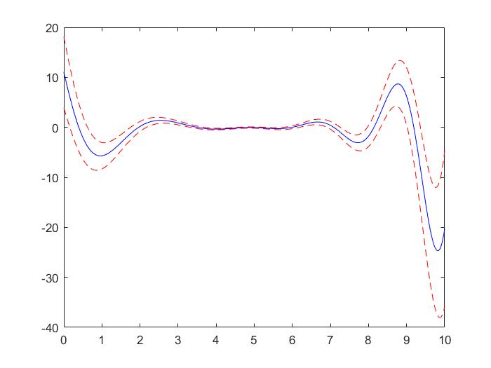

#### 10.9

(a)由行列式展开的特点，构成$s^n$的项为
$$
\prod_{i=1}^n(s-a_{ii})
$$
所以$s^n$的系数为$1$。

(b)由行列式展开的特点，构成$s^{n-1}$的项为
$$
\prod_{i=1}^n(s-a_{ii})
$$
所以$s^{n-1}$的系数为
$$
-\sum_{i=1}^n a_{ii}=-\operatorname{Tr} A
$$
(c)常数项为$s=0$时的多项式的值，即
$$
\mathcal{X}(0)=\operatorname{det}(-A)
$$
(d)第一个等式由定义即可，所以
$$
\begin{aligned}
a_{n-1}&=-\sum_{i=1}^{n} \lambda_{i} \\
a_{0}&=\prod_{i=1}^{n}\left(-\lambda_{i}\right)
\end{aligned}
$$


#### 10.11

由条件可得
$$
A=P^{-1}\Lambda P=\sum_{k=1}^n \lambda_k p_k q_k^T
$$
(a)

range：
$$
\begin{aligned} 
\mathcal{R}\left(R_{k}\right) 
&=\left\{R_{k} x | x \in \mathrm{C}^{n}\right\}\\
&=\left\{p_{k} q_{k}^{T} x | x \in \mathrm{C}^{n}\right\} \\ 
&=\left\{\alpha p_{k} | \alpha \in \mathrm{C}\right\}\\
&=\operatorname{span}\left\{p_{k}\right\} 
\end{aligned}
$$
因此
$$
\text{rank}(R_k) = 1
$$
利用正交矩阵的特点可得正交补空间为
$$
\mathcal{N}\left(R_{k}\right)=\operatorname{span}\left\{p_{i}, i \neq k\right\}
$$
(b)因为
$$
PQ=QP=I
$$
所以
$$
q_i^T p_j=\delta_{ij}
$$
那么对于$i\neq j$
$$
\begin{aligned}
R_{i} R_{j}
&=p_iq_i^T p_j q_j^T\\
&=p_i(q_i^T p_j)q_j^T\\
&=0
\end{aligned}
$$
此外
$$
\begin{aligned}
R_{i} R_{i}
&=p_iq_i^T p_i q_i^T\\
&=p_i(q_i^T p_i)q_i^T\\
&=p_iq_i^T\\
&=R_i
\end{aligned}
$$
(c)
$$
\begin{aligned}
(s I-A)^{-1}
&=( P^{-1}sIP-P^{-1}\Lambda P)^{-1}\\
&=P^{-1}(sI-\Lambda)^{-1} P\\
&=\sum_{k=1}^{n} \frac{R_{k}}{s-\lambda_{k}}
\end{aligned}
$$
(d)因为
$$
PQ=QP=I
$$
所以
$$
\sum_{k=1}^n R_k =\sum_{k=1}^n p_{k} q_{k}^{T}=I
$$
(e)特征值为
$$
\begin{aligned}
\lambda_1& =1\\
\lambda_2 &=-2
\end{aligned}
$$
对应的特征向量为
$$
\begin{aligned}
p_1 &=\frac 1 {\sqrt{10}}\left[
 \begin{matrix}
 3\\
1
  \end{matrix}
  \right]\\
 p_2 &= \left[
 \begin{matrix}
 0\\
 1
  \end{matrix}
  \right]
\end{aligned}
$$
即
$$
P=\left[
 \begin{matrix}
\frac{3}{\sqrt{10}} & 0\\
\frac{1}{\sqrt{10}} &1
  \end{matrix}
  \right]
$$
所以
$$
\begin{aligned}
Q^{-1}&=\left[
 \begin{matrix}
  \frac{\sqrt{10}}{3} & 0 \\
   -\frac 1 3 &1
  \end{matrix}
  \right]\\
 q_1^T&= \left[
 \begin{matrix}
     \frac{\sqrt{10}}{3} & 0 
  \end{matrix}
  \right]\\
  q_2^T&=\left[
 \begin{matrix}

   -\frac 1 3 &1
  \end{matrix}
  \right]
\end{aligned}
$$
因此
$$
\begin{aligned}
R_1&=p_1 q_1^T\\
&=\frac 1 {\sqrt{10}}\left[
 \begin{matrix}
 3\\
1
\end{matrix}
  \right]\left[
 \begin{matrix}
     \frac{\sqrt{10}}{3} & 0 
  \end{matrix}
  \right]\\
  &=\left[
 \begin{matrix}
  1 & 0\\
  \frac 1 3 & 0
  \end{matrix}
  \right]\\
  
  R_2&=p_2 q_2^T\\
  &=\left[
 \begin{matrix}
 0\\
 1
  \end{matrix}
  \right]\left[
 \begin{matrix}

   -\frac 1 3 &1
  \end{matrix}
  \right]\\
  &=\left[
 \begin{matrix}
 0 & 0\\
    -\frac 1 3 &1
  \end{matrix}
  \right]
\end{aligned}
$$


#### 10.19

(a)注意到我们有
$$
\begin{aligned}
y(t)
&=C e^{t A} x(0)\\
&=C e^{t A}\left(x(0) -x_0+x_0\right)\\
&=C e^{t A}\left(x(0) -x_0\right)
+ C e^{t A}x_0 \\
&=C e^{t A}\left(x(0) -x_0\right)+y_{\operatorname{nom}}(t)\\

\end{aligned}
$$
因为
$$
\left\|x(0)-x_{0}\right\| \leq r
$$
所以
$$
-\|C e^{t A} \| r+y_{\operatorname{nom}}(t)\le y(t) \le \|C e^{t A} \|r+y_{\operatorname{nom}}(t)
$$
即
$$
\begin{aligned}
\overline{y}(t)
&=\| C e^{t A} \|r+y_{\operatorname{nom}}(t) \\
\underline{y}(t) &=-\|C e^{t A} \|r+y_{\operatorname{nom}}(t)
\end{aligned}
$$
(b)

```matlab
n = 6 ; 
A =[-0.2880 -1.0174 0.4625 1.2678 -1.6342 0.8384 ;     1.5861 0.3352 2.1051 0.2998 0.3260 0.8293 ;     0.2411 -2.3091 -0.0736 -0.6288 0.1439 0.5105 ;     -1.2803 0.4842 0.7187 -0.8074 0.0901 1.3939 ;     1.2931 1.0224 -0.7501 0.0724 0.0088 1.7703 ;     0.5874 -0.4287 0.5852 -1.4978 -1.9009 -0.1749 ];
C =[-10.3166  3.4759  -0.8583  -2.5407  -3.4990  8.0032];
x_0 =[-1.2413;       0.5541;       -0.3143;       1.0052;       -0.0480;       -0.2018];
r = 0.5000;

%(b)
N = 1000;
t = linspace(0, 10, N);
y_max = zeros(1, N);
y_min = zeros(1, N);
y_nom = zeros(1, N);

for i = 1:N
    ynom = C * expm(A * t(i)) * x_0;
    res = norm(C * expm(A * t(i)) * r);
    y_nom(i) = ynom;
    y_max(i) = ynom + res;
    y_min(i) = ynom - res;
end

plot(t, y_nom, 'b-', t, y_min, 'r--', t, y_max,'r--')
```




#### 11.13

实正规矩阵的形式为
$$
S^{-1} A S=\operatorname{diag}\left(\Lambda_{r},\left[\begin{array}{cc}{\sigma_{r+1}} & {\omega_{r+1}} \\ {-\omega_{r+1}} & {\sigma_{r+1}}\end{array}\right], \ldots,\left[\begin{array}{cc}{\sigma_{n}} & {\omega_{n}} \\ {-\omega_{n}} & {\sigma_{n}}\end{array}\right]\right)
$$
其中
$$
\lambda_{i}=\sigma_{i}+j \omega_{i}, \quad i=r+1, \ldots, n
$$
下面讨论如何得到$S$，假设
$$
S=\left[
 \begin{matrix}
s_1  &\ldots  &s_n
  \end{matrix}
  \right]
$$
对于$ 1\le i \le r$，取$s_i$为对应的特征向量即可。

对于$i\ge r+1$，假设$\lambda_i$对应的复特征向量为
$$
p_i +jq_i
$$
那么
$$
\begin{aligned}
A(p_i+jq_i) 
&=(\sigma_{i}+j \omega_{i})(p_i+jq_i)\\
&=(\sigma_i p_i -\omega_{i} q_i) +j(\omega_{i}p_i +\sigma_{i} q_i)
\end{aligned}
$$
对比实部虚部得到
$$
\begin{aligned}
Ap_i &=(\sigma_i p_i -\omega_{i} q_i)\\
Aq_i &=(\omega_{i}p_i +\sigma_{i} q_i) 
\end{aligned}
$$
所以
$$
A \left[
 \begin{matrix}
   p_i &q_i
  \end{matrix}
  \right]=\left[
 \begin{matrix}
   p_i &q_i
  \end{matrix}
  \right] \left[\begin{array}{cc}{\sigma_{i}} & {\omega_{i}} \\ {-\omega_{i}} & {\sigma_{i}}\end{array}\right]
$$

利用上式计算即可：

```matlab
N = 10;

while 1
    A = randn(N);
    %特征值分解
    [S0, Lambda] = eig(A);
    Lambda = diag(Lambda);
    %计算复特征值的数量
    index = imag(Lambda) ~= 0;
    if sum(index) > 0
        break
    end
end

S = zeros(N);
i = 1;
while i <= N
    if index(i)
        S(:, i) = real(S0(:, i));
        S(:, i + 1) = imag(S0(:, i));
        i = i + 2;
    else
        S(:, i) = S0(:, i);
        i = i + 1;
    end
end

S \ A * S
```

```
ans =
    3.3818    0.0000   -0.0000   -0.0000   -0.0000   -0.0000    0.0000   -0.0000    0.0000    0.0000
    0.0000    1.2037    2.1094   -0.0000   -0.0000   -0.0000    0.0000    0.0000    0.0000    0.0000
    0.0000   -2.1094    1.2037   -0.0000   -0.0000   -0.0000    0.0000   -0.0000   -0.0000    0.0000
    0.0000   -0.0000    0.0000   -0.4661    2.4649    0.0000   -0.0000    0.0000   -0.0000   -0.0000
   -0.0000    0.0000    0.0000   -2.4649   -0.4661   -0.0000   -0.0000    0.0000   -0.0000    0.0000
   -0.0000   -0.0000    0.0000   -0.0000    0.0000   -2.2108    0.9574   -0.0000    0.0000    0.0000
    0.0000   -0.0000    0.0000    0.0000   -0.0000   -0.9574   -2.2108    0.0000    0.0000   -0.0000
   -0.0000   -0.0000    0.0000    0.0000   -0.0000    0.0000   -0.0000   -1.3388    0.0000    0.0000
    0.0000    0.0000    0.0000    0.0000    0.0000   -0.0000    0.0000    0.0000    1.0193    0.4240
   -0.0000   -0.0000    0.0000    0.0000    0.0000   -0.0000    0.0000   -0.0000   -0.4240    1.0193
```


#### 12.1

(a)

设
$$
A=\left[
 \begin{matrix}
a_1^T\\
\vdots \\
a_m^T
  \end{matrix}
  \right],B=\left[
 \begin{matrix}
b_1 &\ldots & b_p
  \end{matrix}
  \right]
$$
那么
$$
\begin{aligned}
{[AB]}_{ij}&=a_i^T b_j =0\\
AB&=\left[
 \begin{matrix}
a_1^T B\\
\vdots \\
a_m^TB
  \end{matrix}
  \right] =0\\
  AB&=\left[
 \begin{matrix}
Ab_1 &\ldots &A b_p
  \end{matrix}
  \right] =0
\end{aligned}
$$
如果$A$列满秩，那么$Ax=0$不存在非零解，从而$b_i =0$，因此$B=0$，这就与题设矛盾，所以$A$行满秩，即
$$
\text{rank}(A)= m \le n
$$
因为
$$
a_i^T B=0 \Leftrightarrow B^T a_i =0
$$
所以$B^T x=0$有$m$个线性无关的解，因此
$$
n-p \ge m\Leftrightarrow n\ge m+p
$$
(b)正确，实际上，对于$A \in \mathbb{R}^{(2k+1) \times (2k+1)}$，该结论都成立。

首先由条件可得
$$
A=-A^T
$$
取行列式可得
$$
\det (A)= (-1)^{2k+1} \det (A) =-\det (A)
$$
那么
$$
\det (A) =0
$$
(c)正确
$$
(I-A)\left(\sum_{i=0}^{k-1} A^{i}\right)=I
$$
(d)不正确，反例如下：
$$
A= \left[
 \begin{matrix}
 1 &1\\
0 &2
  \end{matrix}
  \right],B=\left[
 \begin{matrix}
2 &0\\
0 &1
  \end{matrix}
  \right],AB=\left[
 \begin{matrix}
 2 &1\\
0 &2
  \end{matrix}
  \right]
$$
(e)正确，证明如下：

假设$AB$的$\lambda_i$的特征值对应的特征向量为$q_i$，那么
$$
ABq_i =\lambda_i q_i\Rightarrow BA (Bq_i)=\lambda_i(Bq_i)
$$
所以$\lambda_i $也是$BA$的特征值，反之同理。

(f)不正确，从上题中即可看出

(g)正确，利用反证法，假设$A$不可对角化，那么$A$存在阶数大于$1$的约当块$J$，不难看出$J^2$无法对角化，与题设矛盾。


#### 13.1

首先
$$
\begin{aligned}
\left[\begin{matrix}{\dot x} \\ {\dot z}\end{matrix}\right]
&=\left[\begin{matrix}A x+B_{1} u+B_{2} w_{1}\\ F z+G_{1} v+G_{2} w_{2}
\end{matrix}\right]\\
&= \left[\begin{matrix}A x+B_{1} u+B_{2} H_{1} z\\
F z+G_{1} v+G_{2} \left(C x+D_{1} u+D_{2} w_{1}\right)
\end{matrix}\right]\\
&=\left[\begin{matrix}A x+B_{1} u+B_{2} H_{1} z\\
F z+G_{1} v+G_{2} \left(C x+D_{1} u+D_{2} H_{1} z\right)
\end{matrix}\right]\\
&=\left[\begin{matrix}
A x+B_{2} H_{1} z\\
F z+G_{2} C x+G_{2} D_{2} H_{1} z
\end{matrix}\right]
+
\left[\begin{matrix}
B_1 u\\
 G_{2} D_{1} u +G_1 v
\end{matrix}\right]
\\
&=\left[\begin{matrix}
 A & B_2 H_1 \\
 G_2 C & F+G_2 D_2 H_1
\end{matrix}\right]
\left[\begin{matrix}x \\ z\end{matrix}\right]
+\left[\begin{matrix}
 B_1  &  0\\
 G_2 D_1 &G_1
\end{matrix}\right]
\left[\begin{matrix}{u} \\ {v}\end{matrix}\right]
\end{aligned}
$$
其次
$$
\begin{aligned}
y&=H_{2} z+J w_{2}\\
&=H_2 z +J\left(C x+D_{1} u+D_{2} w_{1}\right) \\
&=H_2 z +JCx +JD_1 u+JD_2 H_{1} z \\
&=\left[\begin{matrix}
 JC & H_2 + JD_2H_1
\end{matrix}\right]
\left[\begin{matrix}x \\ z\end{matrix}\right]
+\left[\begin{matrix}
JD_1  &  0
\end{matrix}\right]
\left[\begin{matrix}{u} \\ {v}\end{matrix}\right]
\end{aligned}
$$


### 补充题

#### 1

因为
$$
Av= \lambda v
$$
所以
$$
\begin{aligned}
f(A) v
&=\sum_{i=0}^{\infty} a_i A^i v\\
&=\left(\sum_{i=0}^{\infty} a_i \lambda^i\right) v\\
&= f(\lambda) v
\end{aligned}
$$

代码如下：

```matlab
n = 3;
A = randn(n);
[S1, Lambda1] = eig(A);
Lambda1 = diag(Lambda1);

% method 1
B = (eye(n) + A) / (eye(n) - A);
[S2, Lambda2] = eig(B);
Lambda2 = diag(Lambda2);

% method 2
Lambda3 = (1 + Lambda1) ./ (1 - Lambda1);

Lambda2
Lambda3
```

```
Lambda2 =
   0.1312 + 1.4362i
   0.1312 - 1.4362i
   0.3422 + 0.0000i
Lambda3 =
   0.3422 + 0.0000i
   0.1312 + 1.4362i
   0.1312 - 1.4362i
```

