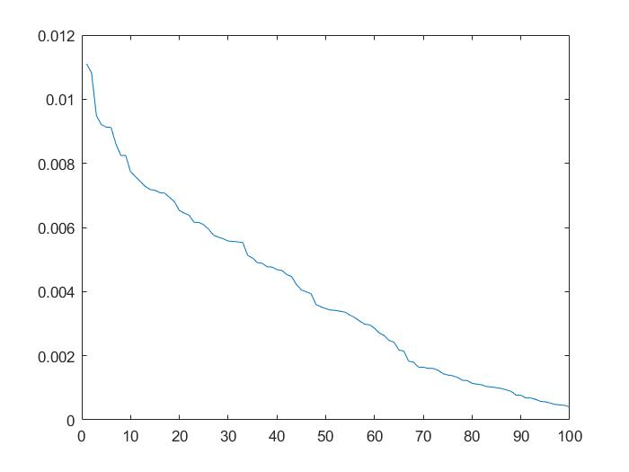

#### 13.17

(a)$z^{-1}$的作用为延迟算子，所以
$$
A=\left[\begin{array}{cccc}{0} & {\cdots} & {} & {} \\ {1} & {0} & {\cdots} & {} \\ {0} & {1} & {0} & {\cdots} & {} \\ {} & {} & {\ddots} & {} \\ {0} & {\cdots} & {0} & {1} & {0}\end{array}\right], \quad B=\left[\begin{array}{c}{1} \\ {0} \\ {\vdots} \\ {0}\end{array}\right], \quad C=\left[\begin{array}{ccc}{0} & {\cdots} & {0} & {1}\end{array}\right], \quad D=0
$$
(b)$A$的特征值全为$0$

(c)
$$
A=
\left[\begin{matrix}{0} & {\cdots} & {} & {}& 10^{-5} \\ {1} & {0} & {\cdots} & {} \\ {0} & {1} & {0} & {\cdots} & {} \\ {} & {} & {\ddots} & {} \\ {0} & {\cdots} & {0} & {1} & {0}\end{matrix}\right],

\quad B=\left[\begin{array}{c}{1} \\ {0} \\ {\vdots} \\ {0}\end{array}\right], \quad C=\left[\begin{array}{ccc}{0} & {\cdots} & {0} & {1}\end{array}\right], \quad D=0
$$


(d)
$$
\det (\lambda I-A)=\lambda^{100}-10^{-5}
$$
特征值为
$$
\lambda =10^{-5/100} e^{2\pi k/100}, k=0,\ldots, 99
$$
(e)系统的效果没有太大变化，但是特征值变化很大。


#### 14.2

假设$A$的秩为$r$，其正交分解为
$$
\begin{aligned}
A&=Q \Lambda Q^T \\
&=\sum_{i=1}^n \lambda_i q_i q_i^T\\
&=\sum_{i=1}^r \lambda_i q_i q_i^T\\
&=\sum_{i=1}^k \lambda_i q_i q_i^T, k\ge r
\end{aligned}
$$
这里假设
$$
\lambda_i =0, i=r+1,\ldots ,n \\
\lambda_1 \ge \ldots \ge \lambda _r
$$
(a)如果$f(x)=\| Fx\|^2$，那么结论显然成立。

如果$f(x)$半正定，那么$\lambda_r >0 $，记
$$
F=  \left[
 \begin{matrix}
  \sqrt{\lambda_1} q_1^T  & \\
  \vdots \\
  \sqrt{\lambda_k} q_k^T
  \end{matrix}
  \right] \in \mathbb R^{k\times n}
$$
那么
$$
F^T F=\sum_{i=1}^k \lambda_i q_i q_i^T =A
$$
从而
$$
\begin{aligned}
f(x)
&=x^T Ax\\
&= x^T F^T Fx\\
&= \| Fx\|^2
\end{aligned}
$$
不难看出最小的$k=r$

(b)因为
$$
\begin{aligned}
\|F x\|^{2}-\|G x\|^{2}
&=x^T\left(F^T F-G^TG\right) x
\end{aligned}
$$
所以
$$
A=F^TF-G^TG
$$
将正负特征值区分开来，设
$$
\lambda_1 \ge  \ldots \ge \lambda_s >0 >\lambda_{s+1}\ldots \ge \lambda _{s+t}, s+t=r
$$
那么
$$
\begin{aligned}
A&=\sum_{i=1}^r \lambda_i q_i q_i^T \\
&=\sum_{i=1}^s \lambda_i q_i q_i^T - \sum_{i=1}^t (-\lambda_{s+i})  q_{s+i} q_{s+i}^T
\end{aligned}
$$
所以我们可取
$$
\begin{aligned}
F&=  \left[
 \begin{matrix}
  \sqrt{\lambda_1} q_1^T  & \\
  \vdots \\
  \sqrt{\lambda_s} q_s^T
  \end{matrix}
  \right] \in \mathbb R^{s\times n} \\
  
 G&=  \left[
 \begin{matrix}
  \sqrt{-\lambda_{s+1}} q_{s+1}^T  & \\
  \vdots \\
  \sqrt{-\lambda_{s+t}} q_{s+t}^T
  \end{matrix}
  \right] \in \mathbb R^{t\times n} 
\end{aligned}
$$
那么
$$
F^T F-G^TG= \sum_{i=1}^r \lambda_i q_i q_i^T =A
$$


#### 14.3

(a)$\forall x\in \mathbb R^n$，
$$
\begin{aligned}
x^T Z^T AZx
&= (Zx)^T A(Zx)\\
&\ge 0
\end{aligned}
$$
(b)必要性由(a)即可，只需证明充分性。

$\forall x\in \mathbb R^n$，取
$$
y= T^{-1} x
$$
那么
$$
\begin{aligned}
y^T T^T ATy
&=(Ty)^T A(Ty)\\
&= x ^TAx\\
&\ge 0
\end{aligned}
$$
所以
$$
A\ge 0
$$


#### 14.4

(a)$\forall x \in \mathbb R^n$，那么
$$
\begin{aligned}
x^T (\alpha A) x
&=\alpha(x^T Ax)\\
& \ge 0\\

x^T (A +B) x
&=x^T Ax+x^T Bx\\
& \ge 0\\
\end{aligned}
$$
(b)假设$k$阶子矩阵为$A_k$，对应的行为$i_1,\ldots ,i_k$，现在$\forall x \in \mathbb R^k $，构造$\tilde x\in \mathbb R^n$使得
$$
\tilde x_{j}=\begin{cases}
x_j & j \in \{i_1,\ldots ,i_k\}\\
0 & 其他
\end{cases}
$$
那么
$$
\begin{aligned}
x^T A_k x
&=\tilde x^T A\tilde x \\
&\ge 0
\end{aligned}
$$
(c)取$x=e_i$即可

(d)考虑子矩阵
$$
A_2 = \left[
 \begin{matrix}
  A_{ii} & A_{ij}\\
  A_{ji} & A_{jj}
  \end{matrix}
  \right] 
$$
由(b)可得$A_2$半正定，所以
$$
x^T A_2 x 
=A_{ii} x_1^2 +2A_{ij} x_1 x_2+A_{jj} x_2^2 \ge 0
$$
恒成立，从而
$$
\Delta =4A_{ij}^2 -4A_{ii} A_{jj} \le 0
$$
即
$$
\left|A_{i j}\right| \leq \sqrt{A_{i i} A_{j j}}
$$


#### 14.6

(a)
$$
\begin{aligned}
G_{ji}
&=\int_{a}^{b} f_{j}(t) f_{i}(t) d t\\
&=\int_{a}^{b} f_{i}(t) f_{j}(t) d t\\
&=G_{ij}
\end{aligned}
$$
记
$$
f(t)=\left[\begin{array}{llll}{f_{1}(t)} & {f_{2}(t)} & {\cdots} & {f_{n}(t)}\end{array}\right]^{T}
$$
那么
$$
\begin{aligned} 
f(t) f(t)^{T}&=\left[\begin{array}{c}{f_{1}(t)} \\ {f_{2}(t)} \\ {\vdots} \\ {f_{n}(t)}\end{array}\right] \\
&=\left[\begin{matrix}
{f_{1}(t) f_{1}(t)} & {f_{1}(t) f_{2}(t)} & {\dots} & {f_{2}(t) f_{n}(t)} \\ 
{f_{2}(t) f_{1}(t)} & {f_{2}(t) f_{2}(t)} & {\cdots} & {f_{2}(t) f_{n}(t)} \\ 
 \vdots & \vdots \\ & & \vdots\\
{f_{n}(t) f_{1}(t)} & {f_{n}(t) f_{2}(t)} & {\cdots} & {f_{n}(t) f_{n}(t)}

\end{matrix}\right]\\
G&= \int_a^b f(t) f(t)^T dt
\end{aligned}
$$
现在$\forall x \in \mathbb R^n$，我们有
$$
\begin{aligned}
x^T G x
&=  x^T\left( \int_a^b f(t) f(t)^T dt\right) x\\
&=\int_a^b (x^T f(t)) (x^T f(t))^T dt \\
&\ge 0
\end{aligned}
$$
所以
$$
G \ge 0
$$
(b)记
$$
G= \left[
 \begin{matrix}
g_1 &\ldots & g_n
  \end{matrix}
  \right]
$$
其中
$$
g_i = \left[
 \begin{matrix}
    \int_{a}^{b} f_{1}(t) f_{i}(t) d t\\
    \vdots \\
     \int_{a}^{b} f_{n}(t) f_{i}(t) d t
  \end{matrix}
  \right]
$$
$\Leftarrow$：如果$f_{1}, \ldots, f_{n}$线性相关，那么存在不全为零的系数$\alpha_1 ,\ldots ,\alpha_n$，使得
$$
\sum_{i=1}^n \alpha_i f_i(t) =0
$$
所以$\forall k=1,\ldots ,n$，
$$
\begin{aligned}
\sum_{i=1}^n \alpha_i  f_k(t)f_i(t) &=0 \\
\sum_{i=1}^n\alpha_i  \int_{a}^b f_k(t)f_i(t) dt & =0
\end{aligned}
$$
即
$$
\sum_{i=1}^n \alpha_i g_i =0
$$
即$G$奇异

$\Rightarrow$：

如果$G$奇异，那么存在不全为零的系数$\alpha_1 ,\ldots ,\alpha_n$，使得
$$
\sum_{i=1}^n \alpha_i g_i =0
$$
所以$\forall k=1,\ldots ,n$，
$$
\sum_{i=1}^n\alpha_i  \int_{a}^b f_k(t)f_i(t) dt  =0
$$
记
$$
h(t)= \sum_{i=1}^n \alpha_i f_i(t)
$$
那么上式等价于
$$
\int_a^b f_k(t) h(t) dt=0
$$
因此
$$
\begin{aligned}
\int_a^b \sum_{k=1}^n \alpha_k f_k(t) h(t) dt
&= \int_a^b h^2(t) dt\\
&=0
\end{aligned}
$$
从而
$$
h(t)=0
$$

即$f_1,\ldots, f_n$线性相关


#### 14.8

$$
\begin{aligned}
\sum_{i=1}^{n-1}\left(x_{i+1}-x_{i}\right)^{2}
&=\sum_{i=1}^{n-1}
\left(x_{i+1}^{2}+x_{i}^{2}-2x_ix_{i+1}\right)\\
&=x_1^2 +x_{n}^2+2\sum_{i=2}^{n-1} x_i^2-2\sum_{i=1}^{n-1}x_i x_{i+1}
\end{aligned}
$$

因此
$$
P= \left[
 \begin{matrix}
1 & -1 & 0 &\ldots & 0 & 0 \\
-1 & 2 &-1 & \ldots & 0 & 0\\
0 & -1 &2 & \ldots & 0 &0 \\
\vdots&\vdots & \vdots &  \ddots  &  \vdots & \vdots\\
0 & 0 &0 & \ldots & 2  &-1 \\
0 & 0 &0 & \ldots & -1  &1 \\
  \end{matrix}
  \right]
$$
显然有
$$
P\ge 0
$$
另一方面，如果
$$
x_i = 1 ,i=1,\ldots ,n
$$
那么
$$
\sum_{i=1}^{n-1}\left(x_{i+1}-x_{i}\right)^{2}=0
$$
所以$P$不是正定矩阵，因此
$$
P\ge 0
$$


#### 14.9

取$x=e_i$可得
$$
\begin{aligned}
e_i^T Ae_i &= a_{ii}\\
e_i^TBe_i &= b_{ii}\\
a_{ii} &= b_{ii}
\end{aligned}
$$
取$x=e_i +e_j$得到
$$
\begin{aligned}
(e_i+e_j)^T A(e_i+e_j) &= a_{ii}+a_{jj} +a_{ij}+a_{ji}=a_{ii}+a_{jj}+2a_{ij} \\
(e_i+e_j)^T B(e_i+e_j) &= b_{ii}+b_{jj} +b_{ij}+b_{ji}=b_{ii}+b_{jj}+2b_{ij} \\
a_{ij} &= b_{ij}
\end{aligned}
$$


#### 14.11

注意到
$$
\| A\|=\max _{x \neq 0} \frac{\|A x\|}{\|x\|}
$$
所以$\forall x$，我们有
$$
\frac{\|A x\|}{\|x\|} < 1 \Rightarrow 
\|A x\| < \|x\|
$$
由上式可得，$A$的特征值的绝对值小于$1$，所以$I+A$的特征值的绝对值大于$0$，从而$I+A$可逆。


#### 14.13

满奇异值分解为
$$
A=U \Sigma V^{T}
$$
其中

- $A \in \mathbb{R}^{n \times n}, {\operatorname {Rank}}(A)=r$
- $U \in \mathbb{R}^{n \times n}, U^{T} U=UU^T=I$
- $V \in \mathbb{R}^{n \times n}, V^{T} V=VV^T=I$
- $\Sigma=\operatorname{diag}\left(\sigma_{1}, \ldots, \sigma_{n}\right)$，其中$\sigma_{1} \geq \cdots \geq \sigma_{n}>0$

所以
$$
\begin{aligned}
A^TA &=  V\Sigma U^T U \Sigma V^{T}\\
&= V\Sigma^2 V^T\\

AA^T &=  U \Sigma V^{T} V\Sigma U^T\\
&= U\Sigma^2 U^T
\end{aligned}
$$
因为
$$
A=A^T
$$
所以
$$
AA^T= A^T A
$$
所以$v_i ,u_i$都是$\sigma_i^2$对应的特征向量，且范数为$1$，从而可得
$$
u_i = \pm v_i
$$
因为
$$
Av_i =\sigma_i u_i =\pm \sigma_i v_i
$$
所以特征值和奇异值的关系为
$$
|\lambda_i| =\sigma_i
$$


#### 14.21

设$A$的正交分解为
$$
S=Q\Lambda Q^T
$$
记
$$
\Lambda^{\frac 12 } = \text{diag}\left(\sqrt{\lambda_1},
\ldots, \sqrt{\lambda_n} \right)
$$
注意这里假设
$$
\lambda_1 \ge \ldots \ge \lambda_n  > 0
$$
那么
$$
S=\left (\Lambda^{\frac 12 } Q^T \right)^T
\left (\Lambda^{\frac 12 } Q^T \right)
$$
从而
$$
x^T Sx = \left (\Lambda^{\frac 12 } Q^T x \right)^T
\left (\Lambda^{\frac 12 } Q^T x \right)
$$
因此
$$
\mathcal{E}_{1} = \left\{ x\Big |
\left\|\Lambda^{\frac 12 } Q^T x \right \| \le 1 \right\}
$$
另一方面
$$
x= A^{-1} y
$$
所以
$$
\mathcal{E}_{2} = \left\{ y\Big |
\left\|A^{-1} y\right \| \le 1 \right\}
$$
(a)对比后不难发现，
$$
\begin{aligned}
A^{-1}&= \Lambda^{\frac 12 } Q^T\\
A&= Q \Lambda^{-\frac 12 }
\end{aligned}
$$
(b)
$$
A^{-1}= \Lambda^{\frac 12 }  Q^T
\Rightarrow S=\left (\Lambda^{\frac 12 } Q^T \right)^T
\left (\Lambda^{\frac 12 } Q^T \right) =A^{-T} A^{-1}
=(AA^T) ^{-1}
$$
(c)对$\mathcal{E}_{2}$稍作变形，
$$
\mathcal{E}_{2} = \left\{ y\Big |
\left\|A^{-1} y\right \| \le 1 \right\}=
\left\{ y\Big |
y^T (AA^T)^{-1} y \le 1 \right\}
$$
另一方面
$$
\mathcal{E}_{1}=\left\{x | x^{T} S x \leq 1\right\}
$$
假设$A$的SVD为
$$
A=U \Sigma V^{T}
$$
那么
$$
\begin{aligned}
(AA^T)^{-1}
&=(U\Sigma^2  U^T)^{-1}\\
&= U\Sigma^{-2} U^T
\end{aligned}
$$
注意
$$
S=Q\Lambda Q^T
$$
所以可以取
$$
A= Q\lambda^{-\frac 12 } V^T
$$
其中$V$任意正交矩阵。


#### 14.33

考虑在如下条件下
$$
\frac{1}{N} \sum_{i=1}^{N} x_{i}=0, \quad \frac{1}{N} \sum_{i=1}^{N} x_{i} x_{i}^{T}=I
$$
最小化
$$
J^2=\frac{1}{N} \sum_{i=1}^{N}\left\|y_{i}-A x_{i}-b\right\|^{2}
=\frac{1}{N} \sum_{i=1}^{N}
\left(y_i^T y_i +x_i^TA^T Ax_i +b^T b-2y_i^T Ax_i -2y_i^T b-2b^T Ax_i\right)
$$
先关于$b$求梯度可得
$$
\nabla_{b} J^2 =\frac 1 N \sum_{i=1}^{N}\left(2b -2y_i-2 Ax_i \right)=0
$$
利用之前的条件可得
$$
\begin{aligned}
\frac 1 N \sum_{i=1}^{N}\left(2b -2y_i-2 Ax_i \right) & =0\\
Nb-\sum_{i=1}^N y_i -A\sum_{i=1}^N x_i &=0 \\
b&=\frac 1 N \sum_{i=1}^N y_i
\end{aligned}
$$
现在令
$$
\begin{aligned}
z_i &=y_i -b \\
X&=\left[\begin{array}{lll}{x_{1}} & {\cdots} & {x_{N}}\end{array}\right] \in \mathbb{R}^{m \times N} \\
Z&=\left[\begin{array}{lll}{z_{1}} & {\cdots} & {z_{N}}\end{array}\right] \in \mathbb{R}^{n \times N}
\end{aligned}
$$
那么
$$
J^2= \frac{1}{N} \| Z-AX \|_F^2
$$
假设$Z$的奇异值分解为
$$
Z= U\Sigma V^T
$$
$m$的一个合适的选择如下：选择$m$，使得$\sigma_m \gg  \sigma_{m+1}$，由最佳近似的性质可得，我们应该选择
$$
AX =\sum_{i=1}^m \sigma_i u_i v_i ^T =U_m \Sigma_m V_m^T
$$
这里
$$
U_m \in \mathbb R^{n\times m}, \Sigma_m \in \mathbb R^{m\times m},
V_m \in \mathbb R^{N\times m}
$$
现在取
$$
A=\frac 1 {\sqrt N }U_m \Sigma_m, X=\sqrt N  V_m^T
$$
那么
$$
\begin{aligned}
\frac 1 N \sum_{i=1}^{N} x_{i} x_{i}^{T}
&=\frac 1N XX^T\\
&=\frac1 N  N V_m^T V_m\\
&=I \\
\sum_{i=1}^{N} x_{i} &= X1_N\\
&=\sqrt N  V_m^T 1_N \\
&=0
\end{aligned}
$$
其中最后一个等号的原因如下：

我们有
$$
\begin{aligned}
\sum_{i=1}^N z_i =Z 1_N= U\Sigma V^T 1_N =0
\end{aligned}
$$
因为$U\Sigma $列满秩，所以我们有
$$
V^T 1_N =0
$$
这可以推出
$$
V_m^T 1_N = 0
$$
将内容总结如下：
$$
\begin{aligned}
z_i &=y_i -b \\
X&=\left[\begin{array}{lll}{x_{1}} & {\cdots} & {x_{N}}\end{array}\right] \in \mathbb{R}^{m \times N} \\
Z&=\left[\begin{array}{lll}{z_{1}} & {\cdots} & {z_{N}}\end{array}\right] \in \mathbb{R}^{n \times N} \\
A&=\frac 1 {\sqrt N }U_m \Sigma_m\\
X&=\sqrt N  V_m^T
\end{aligned}
$$
(b)代码如下：

```matlab
%b
b = mean(Y, 2);
%Z
Z = Y - b * ones([1, N]);
%SVD
[U, Sigma, V] = svd(Z, 0);
tmp = diag(Sigma)
m = 3;
Sigmam = diag(tmp(1: 3))
%A, X
A = U(:, 1:m) * Sigmam / sqrt(N);
X = V(:, 1:m)' * sqrt(N);
X * ones(N, 1)
1 / N * X * X'
%res
res = Z - A * X;
Norm = zeros([1, N]);
for i = 1:N
    Norm(i) = norm(res(:, i));
end
Norm = sort(Norm, 'descend');
plot(Norm)
```




### 补充题

#### 1

(a)取
$$
A= \left[
 \begin{matrix}
  1 & -5\\
  0 & 1
  \end{matrix}
  \right], x=\left[
 \begin{matrix}
  1 \\
  1
  \end{matrix}
  \right]
$$
那么
$$
x^T Ax =1+1-5=-3
$$
正确的做法是先计算
$$
B=\frac 1 2(A+A^T)
$$
如果$B$的特征值非负，那么$x^T A x \ge 0$

(b)
$$
A= \left[
 \begin{matrix}
 2& 0\\
  0 & 2
  \end{matrix}
  \right],B=  \left[
 \begin{matrix}
1 & 0\\
  0 & 3
  \end{matrix}
  \right]
$$
那么
$$
A-B=\left[
 \begin{matrix}
 1& 0\\
  0 & -1
  \end{matrix}
  \right],
  B-A=\left[
 \begin{matrix}
 -1& 0\\
  0 & 1
  \end{matrix}
  \right]
$$


